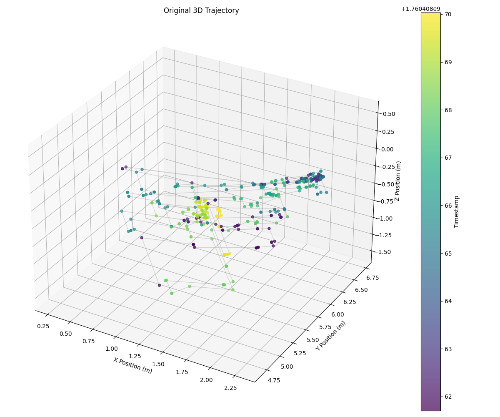
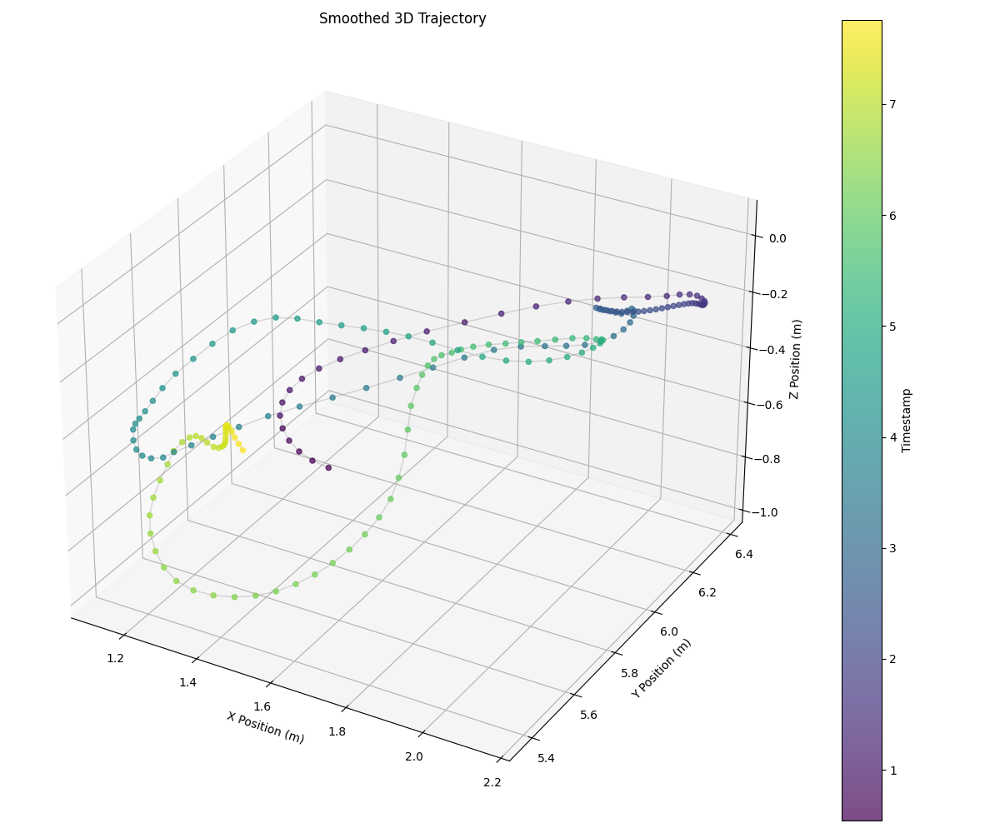

# Checking Preprocessing data

We provide ways on plotting the gathered raw data to see if the data is healthy.
Mainly we show the difference between the raw data and the data after the processing pipeline

These files can be found in ```codebase/util/visualise_coordinates.py```

### Folder structure
The scripts currently pulls a fall file from the training data folder.
You can change the path to any other csv file that you wish to test.

The jump filter and savitzky-golay filter are used by this script.

### What it does
1) Loads a raw csv file containing 3d positional data
2) Preprocess the data using the preprocesing pipeline
3) Plotting - Plot the processed data which should show a smoothening of noise.

Some example outputs are shown below



