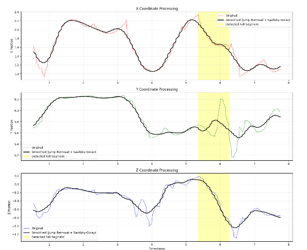

# Checking Model

We also provide ways to check how well the model performs.

```code\util\visualize.py``` contains code that can plot all 3d coordinate data, whilst also highlighting in yellow when the model has determined a fall has occured

### Folder Structure
The file must be placed with a trace file, trained model (model_pos.pkl and scaler_pos.pkl) and the two helper modules (jump filter and savistzky golay)

They must all be located within the same level

### How it works
1) Load the text file
2) Proprocess (jump, downsample, etc..)
3) Feature extraction
4) Model classifcation
5) Plotting

An example output can found below
