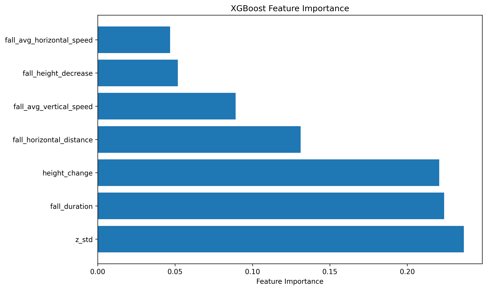

# Results of model

Once we have trained the model we were able to get the feature importance laid below.

We were able to carry out real time testing and were able to reach an accuracy for true falls at 91% and a false positive error rate at 12%.

More details about the final testing numbers can be found under Part 4 Projec Final numbers.xlsx